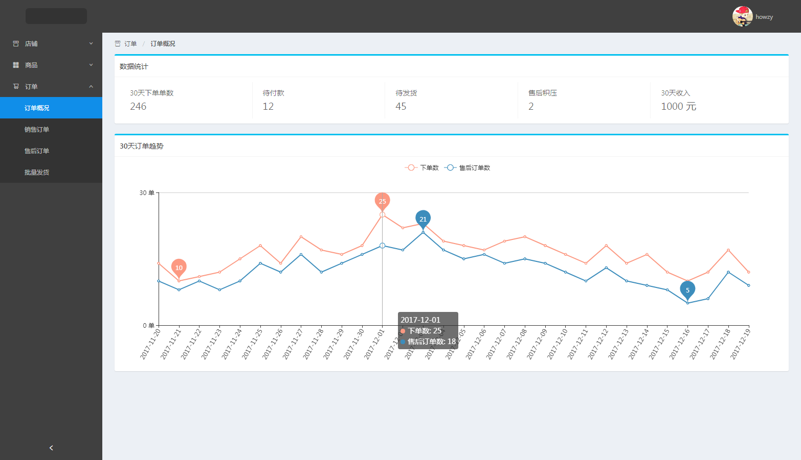

# ng-management-system

基于 Angular2 + NG-ZORRO 的后台管理系统。[线上地址](https://zhouhao.me/ng-management-system/)

## 功能

- [x] 登录/注销
- [x] 表格
- [x] 表单
- [x] 图表: Echart
- [x] 富文本编辑器
- [x] 图片上传
- [x] 图片预览

## 安装步骤

```
git clone https://github.com/howzy/ng-management-system.git      // 把项目下载到本地
cd ng-management-system    // 进入项目目录
npm install         // 安装项目依赖，等待安装完成之后
```

## 本地开发

```
// 开启服务器，浏览器访问 http://localhost:4200
npm start
```

## 构建生产

```
// 执行构建命令，生成的dist文件夹放在服务器下即可访问
npm build
```

## 项目截图


